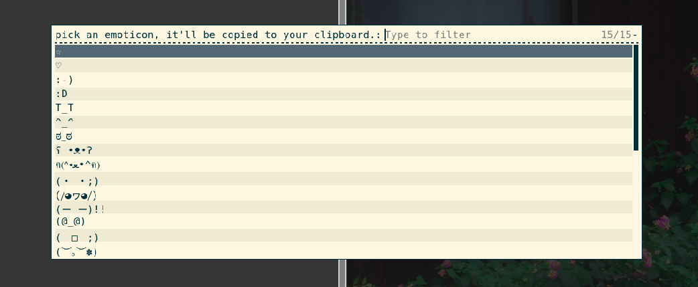

# emoji + emoticon picker
a simple GUI that lets you pick from a variety of characters *(including two modes: emojis and emoticons)* and copies it to your clipboard

## small note
this script uses `xclip` so in order to use it you must pre-install it with whichever package manager you use.

enjoy!

